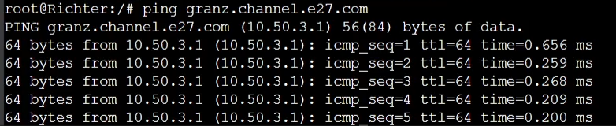

# Praktikum Modul 3 Jaringan Komputer

# Anggota Kelompok E27 :
| No.  | Nama Anggota       | NRP          |
|------|--------------------|--------------|
| 1    |Rachman Ridwan       | 5025201061   |
| 2    | Akmal Nafis         | 5025211216   |

# Topologi


# Konfigurasi network dan ./bashrc
- **Aura (DHCP Relay)**
```
auto eth0
iface eth0 inet dhcp

auto eth1
iface eth1 inet static
	address 10.50.1.0
	netmask 255.255.255.0

auto eth2
iface eth2 inet static
	address 10.50.2.0
	netmask 255.255.255.0

auto eth3
iface eth3 inet static
	address 10.50.3.0
	netmask 255.255.255.0

auto eth4
iface eth4 inet static
	address 10.50.4.0
	netmask 255.255.255.0

up iptables -t nat -A POSTROUTING -o eth0 -j MASQUERADE -s 10.50.0.0/16
#echo 'nameserver 192.168.122.2' > /etc/resolv.conf

```
  ```sh
apt-get update
apt install isc-dhcp-relay -y
  ```


- **Himmel**
```
auto eth0
iface eth0 inet static
	address 10.50.1.1
	netmask 255.255.255.0
	gateway 10.50.1.0

```
  ```sh
echo 'nameserver 10.50.1.2' > /etc/resolv.conf   
apt-get update
apt install isc-dhcp-server -y
  ```
- **Heiter**
```
auto eth0
iface eth0 inet static
	address 10.50.1.2
	netmask 255.255.255.0
	gateway 10.50.1.0
```
  ```sh
  echo 'nameserver 192.168.122.1' > /etc/resolv.conf
  apt-get update
  apt-get install bind9 -y  
  ```
- **Denken**
```
auto eth0
iface eth0 inet static
	address 10.50.2.1
	netmask 255.255.255.0
	gateway 10.50.2.0
```
```sh
  echo 'nameserver 10.50.1.2' > /etc/resolv.conf
  apt-get update
  apt-get install mariadb-server -y
  ```
- **Eisen**
```
auto eth0
iface eth0 inet static
	address 10.50.2.2
	netmask 255.255.255.0
	gateway 10.50.2.0
```
  ```sh
echo 'nameserver 10.50.1.2' > /etc/resolv.conf
apt-get update
apt-get install lynx -y
apt-get install apache2-utils -y
apt-get install nginx -y
service nginx start
  ```
## Worker PHP
- **Lawine**
```
auto eth0
iface eth0 inet static
	address 10.50.3.3
	netmask 255.255.255.0
	gateway 10.50.3.0
```
- **Linie**
```
auto eth0
iface eth0 inet static
	address 10.50.3.2
	netmask 255.255.255.0
	gateway 10.50.3.0
```
- **Lugner**
```
auto eth0
iface eth0 inet static
	address 10.50.3.1
	netmask 255.255.255.0
	gateway 10.50.3.0
```
  ```sh
  echo 'nameserver 10.50.1.2' > /etc/resolv.conf
  apt-get update
  apt-get install unzip -y
  apt-get install lynx -y
  apt-get install htop -y
  apt-get install nginx -y
  apt-get install wget -y
  apt-get install apache2-utils -y
  apt-get install php7.3-fpm 
service nginx start
service php7.3-fpm start
  ```
## Worker Laravel
- **Frieren**
```
auto eth0
iface eth0 inet static
	address 10.50.4.3
	netmask 255.255.255.0
	gateway 10.50.4.0
```
- **Flamme**
```
auto eth0
iface eth0 inet static
	address 10.50.4.2
	netmask 255.255.255.0
	gateway 10.50.4.0
```
- **Fern**
```
auto eth0
iface eth0 inet static
	address 10.50.4.1
	netmask 255.255.255.0
	gateway 10.50.4.0
```
```sh
  echo 'nameserver 10.50.1.2' > /etc/resolv.conf
  apt-get update
  apt-get install lynx -y
  apt-get install mariadb-client -y
```
## client
```
auto eth0
iface eth0 inet dhcp
```
  ```sh
  apt update
  apt install lynx -y
  apt install htop -y
  apt install apache2-utils -y
  ```

# 1 
Melakukan register domain berupa riegel.canyon.yyy.com untuk worker Laravel dan granz.channel.yyy.com untuk worker PHP (0) mengarah pada worker yang memiliki IP [prefix IP].x.1. sesuai dengan konfigurasi diatas , kemudia semua CLIENT harus menggunakan konfigurasi dari DHCP Server.

- Pertama kita mengatur konfigurasi pada DNS server (Helter)

```sh
echo 'zone "riegel.canyon.e27.com" {
    type master;
    file "/etc/bind/sites/riegel.canyon.e27.com";
};

zone "granz.channel.e27.com" {
    type master;
    file "/etc/bind/sites/granz.channel.e27.com";
};

zone "1.50.10.in-addr.arpa" {
    type master;
    file "/etc/bind/sites/1.50.10.in-addr.arpa";
};' > /etc/bind/named.conf.local

mkdir -p /etc/bind/sites

cp /etc/bind/db.local /etc/bind/sites/riegel.canyon.e27.com
cp /etc/bind/db.local /etc/bind/sites/granz.channel.e27.com
cp /etc/bind/db.local /etc/bind/sites/1.50.10.in-addr.arpa

echo ';
; BIND data file for local loopback interface
;
$TTL    604800
@       IN      SOA     riegel.canyon.e27.com. root.riegel.canyon.e27.com. (
                        202311001      ; Serial
                         604800         ; Refresh
                          86400         ; Retry
                        2419200         ; Expire
                         604800 )       ; Negative Cache TTL
;
@       IN      NS      riegel.canyon.e27.com.
@       IN      A       10.50.4.1     ; IP Fern
www     IN      CNAME   riegel.canyon.e27.com.' > /etc/bind/sites/riegel.canyon.e27.com

echo '
; BIND data file for local loopback interface
;
$TTL    604800
@       IN      SOA     granz.channel.e27.com. root.granz.channel.e27.com. (
                        2023110401      ; Serial
                         604800         ; Refresh
                          86400         ; Retry
                        2419200         ; Expire
                         604800 )       ; Negative Cache TTL
;
@       IN      NS      granz.channel.e27.com.
@       IN      A       10.50.3.1     ; IP Lugner
www     IN      CNAME   granz.channel.e27.com.' > /etc/bind/sites/granz.channel.e27.com

echo 'options {
      directory "/var/cache/bind";

      forwarders {
              192.168.122.1;
      };

      // dnssec-validation auto;
      allow-query{any;};
      auth-nxdomain no;    # conform to RFC1035
      listen-on-v6 { any; };
}; ' >/etc/bind/named.conf.options

service bind9 start
```



# Soal 2
Client yang melalui Switch3 mendapatkan range IP dari [prefix IP].3.16 - [prefix IP].3.32 dan [prefix IP].3.64 - [prefix IP].3.80 
- 

```sh
echo 'subnet 10.50.1.0 netmask 255.255.255.0 {
}
subnet 10.50.2.0 netmask 255.255.255.0 {
}
subnet 10.50.3.0 netmask 255.255.255.0 {
    range 10.50.3.16 10.50.3.32;
    range 10.50.3.64 10.50.3.80;
    option routers 10.50.3.0;
}

subnet 10.50.4.0 netmask 255.255.255.0 {
    range 10.50.4.12 10.50.4.20;
    range 10.50.4.160 10.50.4.168;
    option routers 10.50.4.0;
} ' > /etc/dhcp/dhcpd.conf
```
# Soal 3
Client yang melalui Switch4 mendapatkan range IP dari [prefix IP].4.12 - [prefix IP].4.20 dan [prefix IP].4.160 - [prefix IP].4.168 
- 

```sh
echo 'subnet 10.50.1.0 netmask 255.255.255.0 {
}

subnet 10.50.2.0 netmask 255.255.255.0 {
}

subnet 10.50.3.0 netmask 255.255.255.0 {
    range 10.50.3.16 10.50.3.32;
    range 10.50.3.64 10.50.3.80;
    option routers 10.50.3.0;
}

subnet 10.50.4.0 netmask 255.255.255.0 {
    range 10.50.4.12 10.50.4.20;
    range 10.50.4.160 10.50.4.168;
    option routers 10.50.4.0;
} ' > /etc/dhcp/dhcpd.conf
```
# Soal 4
Client mendapatkan DNS dari Heiter dan dapat terhubung dengan internet melalui DNS tersebut
- 

```sh
echo 'subnet 10.50.1.0 netmask 255.255.255.0 {
}

subnet 10.50.2.0 netmask 255.255.255.0 {
}

subnet 10.50.3.0 netmask 255.255.255.0 {
    range 10.50.3.16 10.50.3.32;
    range 10.50.3.64 10.50.3.80;
    option routers 10.50.3.0;
    option broadcast-address 10.50.3.255;
    option domain-name-servers 10.50.1.2;
}

subnet 10.50.4.0 netmask 255.255.255.0 {
    range 10.50.4.12 10.50.4.20;
    range 10.50.4.160 10.50.4.168;
    option routers 10.50.4.0;
    option broadcast-address 10.50.4.255;
    option domain-name-servers 10.50.1.2;
} ' > /etc/dhcp/dhcpd.conf

service isc-dhcp-server start
```

- uncomment pada file ``/etc/sysctl.conf`` pada net.ipv4 ip forward


- Atur konfigurasi pada DHCP relay pada file /etc/default/isc-dhcp-relay kemudian jalankan ulang
```
# What servers should the DHCP relay forward requests to?
SERVERS="10.50.1.1"

# On what interfaces should the DHCP relay (dhrelay) serve DHCP requests?
INTERFACES="eth1 eth2 eth3 eth4"
```
- check pada client 


# Soal 5
Lama waktu DHCP server meminjamkan alamat IP kepada Client yang melalui Switch3 selama 3 menit sedangkan pada client yang melalui Switch4 selama 12 menit. Dengan waktu maksimal dialokasikan untuk peminjaman alamat IP selama 96 menit

```sh
echo 'subnet 10.50.1.0 netmask 255.255.255.0 {
}

subnet 10.50.2.0 netmask 255.255.255.0 {
}

subnet 10.50.3.0 netmask 255.255.255.0 {
    range 10.50.3.16 10.50.3.32;
    range 10.50.3.64 10.50.3.80;
    option routers 10.50.3.0;
    option broadcast-address 10.50.3.255;
    option domain-name-servers 10.50.1.2;
    default-lease-time 180;
    max-lease-time 5760;
}

subnet 10.50.4.0 netmask 255.255.255.0 {
    range 10.50.4.12 10.50.4.20;
    range 10.50.4.160 10.50.4.168;
    option routers 10.50.4.0;
    option broadcast-address 10.50.4.255;
    option domain-name-servers 10.50.1.2;
    default-lease-time 720;
    max-lease-time 5760;
}

service isc-dhcp-server restart
```

- restart client, kemudian cek lease timenya


# Soal 6
Pada masing-masing worker PHP, lakukan konfigurasi virtual host untuk website berikut dengan menggunakan php 7.3
jalankan perintah wget dan unzip untuk menyimpan filenya, kemudian lakukan konfigurasi 
```sh
wget -o '/var/www/granz.channel.e27.com' 'https://drive.google.com/u/0/uc?id=1ViSkRq7SmwZgdK64eRbr5Fm1EGCTPrU1&export=download'
unzip -o /var/www/granz.channel.e27.com -d /var/www/

rm /var/www/granz.channel.e27.com
mv /var/www/modul-3 /var/www/granz.channel.e27.com

#konfigurasi nginx

cp /etc/nginx/sites-available/default /etc/nginx/sites-available/granz.channel.e27.com
ln -s /etc/nginx/sites-available/granz.channel.e27.com /etc/nginx/sites-enabled/
rm /etc/nginx/sites-enabled/default

echo 'server {
    listen 80;
    server_name _;

    root /var/www/granz.channel.e27.com;
    index index.php index.html index.htm;

    location / {
        try_files $uri $uri/ /index.php?$query_string;
    }

    location ~ \.php$ {
        include snippets/fastcgi-php.conf;
        fastcgi_pass unix:/run/php/php7.3-fpm.sock; 
        fastcgi_param SCRIPT_FILENAME $document_root$fastcgi_script_name;
        include fastcgi_params;
    }
}' > /etc/nginx/sites-available/granz.channel.e27.com
```
- kemudian jalankan service nginx restart, bisa kita lihat pada worker php akan muncul tampilan berikut dengan menggunakan command `lynx localhost`


# Soal 7
Aturlah agar Eisen dapat bekerja dengan maksimal, lalu lakukan testing dengan 1000 request dan 100 request/second.
- lakukan konfigurasi pada DNS server untuk mengatur domain ke arah load balancer

```
echo ';
; BIND data file for local loopback interface
;
$TTL    604800
@       IN      SOA     riegel.canyon.e27.com. root.riegel.canyon.e27.com. (
                        2023110401      ; Serial
                         604800         ; Refresh
                          86400         ; Retry
                        2419200         ; Expire
                         604800 )       ; Negative Cache TTL
;
@       IN      NS      riegel.canyon.e27.com.
@       IN      A       10.50.2.2     ; IP Eisen
www     IN      CNAME   riegel.canyon.e27.com.' > /etc/bind/sites/riegel.canyon.e27.com


echo '
; BIND data file for local loopback interface
;
$TTL    604800
@       IN      SOA     granz.channel.e27.com. root.granz.channel.e27.com. (
                        2023110401      ; Serial
                         604800         ; Refresh
                          86400         ; Retry
                        2419200         ; Expire
                         604800 )       ; Negative Cache TTL
;
@       IN      NS      granz.channel.e27.com.
@       IN      A       10.50.2.2     ; IP Eisen
www     IN      CNAME   granz.channel.e27.com.' > /etc/bind/sites/granz.channel.e27.com
```

- lakukan konfigurasi pada Load Balancer (Eisein)

```
cp /etc/nginx/sites-available/default /etc/nginx/sites-available/lb_php

echo ' upstream worker {
    server 10.50.3.1;
    server 10.50.3.2;
    server 10.50.3.3;
}

server {
    listen 80;
    server_name granz.channel.e27.com www.granz.channel.e27.com;

    root /var/www/html;
    index index.html index.htm index.nginx-debian.html;
    server_name _;

    location / {
        proxy_pass http://worker;
    }
} ' > /etc/nginx/sites-available/lb_php

ln -s /etc/nginx/sites-available/lb_php /etc/nginx/sites-enabled/
rm /etc/nginx/sites-enabled/default
service nginx restart

```

- test menggunakan apacheberchmark diclient

# Soal 8
Hasil testing dengan 200 request dan 10 request/second masing-masing algoritma Load Balancer 
untuk test jalankan command berikut `ab -n 200 -c 10 http://www.granz.channel.e27.com/ `

**Round Robin**


**IP Hash**


**Least Connected**


- Grafik 


# Soal 9
lakukan testing dengan menggunakan 3 worker, 2 worker, dan 1 worker sebanyak 100 request dengan 10 request/second, kemudian tambahkan grafiknya pada grimoire.

- Satu Worker


- Dua Worker


- Tiga Worker


# Soal 10
# Soal 11
# Soal 12
# Soal 13
# Soal 14
# Soal 15
# Soal 16
# Soal 17
# Soal 18
# Soal 19
# Soal 20